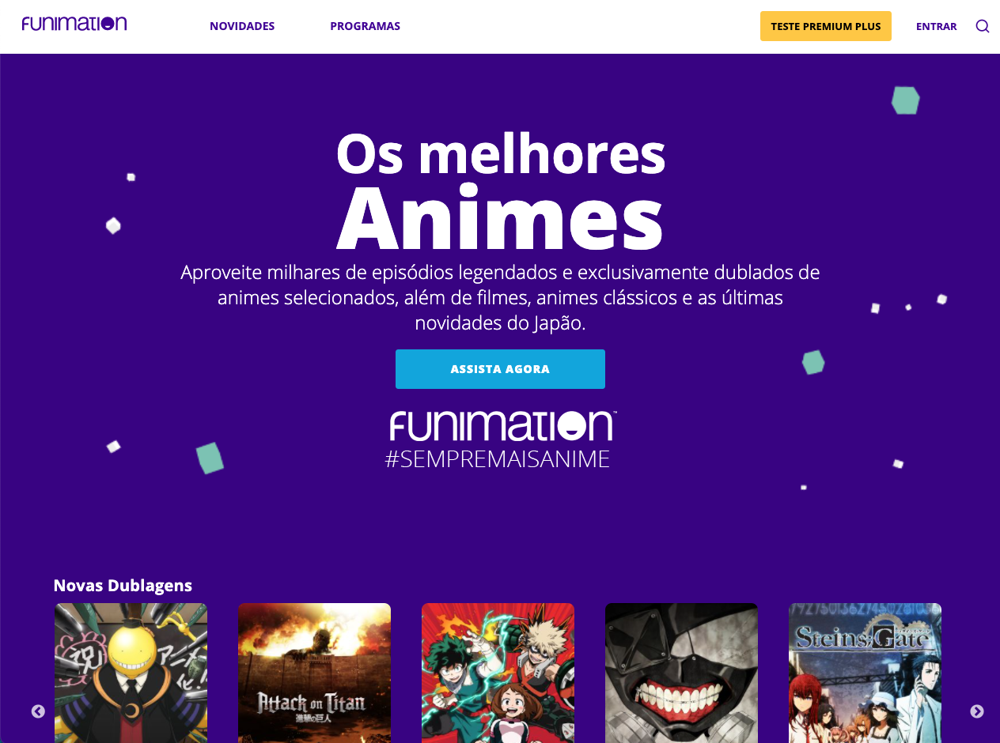

# Funimation Clone

### In the project directory, you can run:
### `yarn start`

This project is a study case in order to study the React Fundamentals, How components work and Some CSS Pre-processor. There's not a lot of functionality apart from the landing page.

Disclaimer : The App does not intend to be a perfect clone of the real funimation.com website and it's somewhat not fully responsive

You can check out the clone at https://funimation.netlify.app

